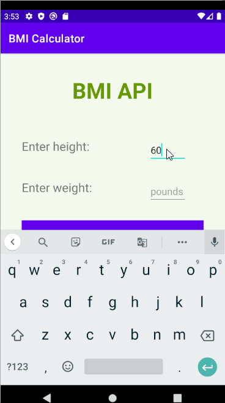

# BMI Calculator

BMI (Body Mass Index) Calculator app for Android.

- BMI Categories:
-- Underweight = < 18.5
-- Normal weight = 18.5–24.9
-- Overweight = 25–29.9
-- Obesity = BMI of 30 or greater

## Video Walkthrough

GIF created with [LiceCap](http://www.cockos.com/licecap/).